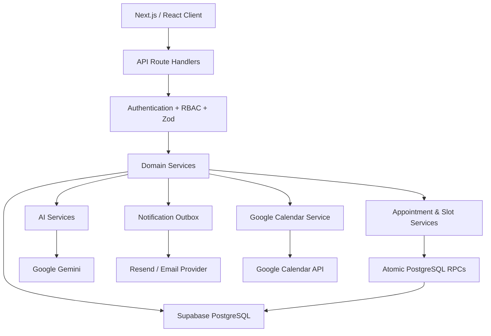

# 🏥 Hospital Management System (HMS)

**Production-oriented full-stack healthcare operations platform for appointment scheduling, clinical workflows, AI-assisted documentation, pharmacy, billing, notifications, and Google Calendar synchronization.**

[](https://nextjs.org/)
[](https://react.dev/)
[](https://www.typescriptlang.org/)
[](https://tailwindcss.com/)
[](https://supabase.com/)
[](https://ai.google.dev/)
[](https://vitest.dev/)
[](https://vercel.com/)

---

## 🌐 Live Demo

### [🚀 Open the Live Application](https://hospital-management-system-v2-ashy.vercel.app/)

**Hosted Application:**  
https://hospital-management-system-v2-ashy.vercel.app/

**Source Code:**  
https://github.com/Ziggyyyyyyyy/hospital-management-system-v2

The application is deployed on Vercel and uses Supabase PostgreSQL for persistence and authentication.

> **Demo environment:** Do not enter real patient information or production healthcare data.

---

## 🎯 Problem Statement

Healthcare workflows are often fragmented across appointment scheduling, doctor availability, patient records, admissions, pharmacy inventory, billing, notifications, and clinical documentation.

The **Hospital Management System (HMS)** unifies these workflows through role-based workspaces and transactional backend services.

The platform focuses on the engineering challenges that make healthcare scheduling and operations difficult:

- Preventing simultaneous users from booking the same appointment slot
- Temporarily reserving slots during the booking process
- Handling doctor leave and existing appointment conflicts
- Delivering notifications reliably when external providers fail
- Supporting AI-assisted clinical documentation without making AI a hard dependency
- Synchronizing appointments with Google Calendar
- Protecting sensitive credentials and OAuth tokens

---

## 👥 User Roles

| Role | Responsibilities |
|---|---|
| **Admin** | Staff management, doctors, nurses, rooms, billing, and analytics |
| **Doctor** | Availability, schedules, leave, consultations, records, and prescriptions |
| **Nurse** | Admissions, assigned patients, and inpatient workflows |
| **Patient** | Doctor discovery, appointment booking, records, and billing |
| **Pharmacist** | Medicine inventory, dispensing, and stock management |

---

# ✨ Key Features

## 🔐 Role-Based Access Control

- Supabase authentication with JWT-backed sessions
- Role-specific dashboards
- API-level authorization
- Resource ownership checks
- PostgreSQL Row Level Security (RLS)
- Server-side authorization
- Zod request validation

Authorization is enforced at the backend rather than relying only on frontend visibility.

---

## 📅 Concurrency-Safe Appointment Scheduling

Appointment booking is implemented as a transactional workflow instead of relying only on client-side availability checks.

### Supported mechanisms

- Dynamic doctor slot generation
- Temporary 5-minute slot holds
- PostgreSQL advisory locks
- Row-level locking using `FOR UPDATE`
- Atomic booking RPCs
- Hold ownership validation
- Hold expiration
- Idempotent booking confirmation
- Appointment state-transition validation
- Double-booking prevention

### Booking Lifecycle

```text
Available Slot
      │
      ▼
┌──────────────────────────┐
│   atomic_hold_slot()     │
│                          │
│ • Advisory lock          │
│ • Availability check     │
│ • Hold token generation  │
│ • Expiration timestamp   │
└────────────┬─────────────┘
             │
             ▼
           HELD
             │
       ┌─────┴─────┐
       │           │
   Confirm       Expire
       │           │
       ▼           ▼
┌────────────┐  AVAILABLE
│ atomic_    │
│ confirm_   │
│ booking()  │
└─────┬──────┘
      │
      ▼
   BOOKED
```

### Double-Booking Prevention

The system does not trust a frontend availability check as the final authority.

Concurrent booking attempts are protected using:

1. **PostgreSQL advisory locks** to serialize concurrent operations.
2. **Row-level locking / `FOR UPDATE`** where required.
3. **Atomic database RPCs** for slot holding and confirmation.
4. **Unique `hold_token` ownership** for temporary reservations.
5. **Expiration validation** for stale holds.
6. **Idempotent confirmation** to prevent duplicate processing.
7. **Transactional state transitions** at the database layer.

This ensures that simultaneous booking attempts cannot independently confirm the same slot.

---

## ⏱️ Temporary Slot Hold Mechanism

A selected slot can be temporarily reserved before the patient completes confirmation.

**Default hold duration: 5 minutes.**

The hold mechanism:

- Creates a temporary reservation
- Generates a unique `hold_token`
- Associates the hold with the requesting user
- Prevents competing users from acquiring the held slot
- Validates the token during confirmation
- Rejects expired holds
- Releases stale holds
- Converts a valid hold into a confirmed appointment atomically

### Hold Lifecycle

```text
AVAILABLE
    │
    ▼
  HELD
    │
    ├──────────────► Expired
    │                   │
    │                   ▼
    │               AVAILABLE
    │
    ▼
 Confirmed
    │
    ▼
 BOOKED
```

This prevents abandoned booking sessions from permanently blocking appointment availability.

---

## 👨‍⚕️ Doctor Availability & Leave Management

The scheduling system supports:

- Doctor working hours
- Break periods
- Slot duration configuration
- Recurring availability
- Doctor leave
- Dynamic slot generation
- Leave conflict detection
- Existing appointment conflict handling
- Patient notifications

### Doctor Leave Conflict Handling

Doctor leave is processed as a scheduling event rather than simply changing an availability flag.

The database workflow uses `process_doctor_leave_conflicts` to handle appointments affected by leave.

```text
Doctor Leave Created
        │
        ▼
Detect Conflicting Appointments
        │
        ▼
Block Affected Slots
        │
        ▼
Release / Handle Relevant Holds
        │
        ▼
Process Appointment Conflicts
        │
        ▼
Create Patient Notifications
        │
        ▼
Rescheduling Workflow
```

This prevents slots from remaining bookable while the doctor is unavailable and provides a controlled workflow for already-booked patients.

---

# 🤖 AI-Assisted Clinical Documentation

Google Gemini is integrated into two clinical documentation workflows.

## 🧠 Pre-Visit AI

Patients can provide symptom information before their appointment.

The AI workflow generates structured information including:

- Chief complaint
- Urgency classification
- Suggested diagnostic questions

The expected structured output includes:

```json
{
  "urgency": "LOW | MEDIUM | HIGH",
  "chief_complaint": "...",
  "suggested_questions": [
    "...",
    "...",
    "..."
  ]
}
```

The result is validated before persistence.

---

## 📝 Post-Visit AI

After a consultation, the system can process:

- Doctor clinical notes
- Diagnosis
- Follow-up instructions
- Prescription information

The AI produces patient-oriented structured information such as:

- Visit explanation
- Medication schedule
- Follow-up steps
- Instructions

AI processing is intentionally non-blocking. External AI failures are recorded and handled without invalidating the core healthcare transaction.

Detailed prompt documentation:

[`docs/LLM_PROMPTS.md`](docs/LLM_PROMPTS.md)

---

## 🛡️ AI Failure & Fallback Handling

The AI pipeline handles:

- Patient consent / opt-out
- Missing Gemini credentials
- Provider/API failures
- Network errors
- Invalid JSON
- Malformed model output
- Runtime schema validation failures

AI output is validated before being persisted, preventing malformed model responses from directly corrupting application data.

---

# 📬 Reliable Notification System

Notifications are implemented using an outbox-oriented architecture.

Supported notification workflows include:

- Appointment confirmation
- Appointment cancellation
- Appointment rescheduling
- Doctor leave conflict notifications
- AI summary notifications
- Appointment reminders
- Medication reminders

### Notification Flow

```text
Core Business Transaction
          │
          ▼
   Notification Event
          │
          ▼
    Transaction Commit
          │
          ▼
 Notification Processor
          │
      ┌───┴────┐
      │        │
   Success   Failure
      │        │
      ▼        ▼
    SENT     Retry
               │
               ▼
       Exponential Backoff
```

### Reliability Features

- Notification persistence
- Provider abstraction
- Resend delivery
- Development stub provider
- `dedupe_key` based deduplication
- Failure tracking
- Retry processing
- Exponential backoff
- Provider message ID tracking

The notification provider is deliberately isolated from the core appointment transaction.

> **An email-provider failure should not roll back a successfully created appointment.**

---

# 📆 Google Calendar Integration

HMS integrates with Google Calendar using OAuth 2.0.

### Supported Operations

- OAuth authorization
- Offline access
- Token refresh
- Calendar event creation
- Appointment rescheduling synchronization
- Appointment cancellation synchronization
- Attendee email invitations

### OAuth Flow

```text
/api/calendar/authorize
          │
          ▼
   Google OAuth Consent
          │
          ▼
/api/calendar/callback
          │
          ▼
 Authorization Code Exchange
          │
          ▼
Encrypted Token Persistence
          │
          ▼
Automatic Token Refresh
```

OAuth tokens are encrypted using **AES-256-GCM** before database persistence.

Detailed setup instructions:

[`docs/GOOGLE_CALENDAR_SETUP.md`](docs/GOOGLE_CALENDAR_SETUP.md)

---

# 🏗️ System Architecture



---

# 🔄 Request Lifecycle

A typical request follows a layered execution model:

```text
Client
  │
  ▼
Route Handler
  │
  ├── Authentication
  ├── Identity Resolution
  ├── RBAC
  └── Zod Validation
  │
  ▼
Domain Service
  │
  ├── Business Rules
  ├── Ownership Checks
  ├── Idempotency
  └── External Integrations
  │
  ▼
Supabase PostgreSQL
  │
  ├── RLS
  ├── Transactions
  ├── Constraints
  ├── Locks
  └── Atomic RPCs
```

---

# 🗄️ Database Design

The system uses **Supabase PostgreSQL** with relational tables, enums, constraints, RLS policies, triggers, stored procedures, and atomic RPCs.

### Core database areas

| Area | Examples |
|---|---|
| Identity | `users`, `patients`, `medical_staff` |
| Doctors | `departments`, `specialties`, `doctor_specialties` |
| Scheduling | `doctor_availability`, `doctor_leave`, `appointment_slots` |
| Booking | `slot_holds`, `appointments` |
| AI | `symptom_intakes`, `ai_previsit_summaries`, `post_visit_summaries` |
| Clinical | `medical_records`, `treatments`, `prescriptions` |
| Pharmacy | `medicine_stock`, `medicine_dispense` |
| Inpatient | `rooms`, `admissions` |
| Billing | `billing`, `billing_items` |
| Integrations | `notifications`, `user_oauth_tokens`, `calendar_events` |
| Security | `audit_logs` |

The database contains **30 tables and 6 custom PostgreSQL enums**, along with atomic scheduling and state-transition functions.

Detailed documentation:

[`docs/DATABASE.md`](docs/DATABASE.md)

---

# 💊 Pharmacy Management

The pharmacy module supports:

- Medicine inventory
- Stock tracking
- Low-stock monitoring
- Prescription-based dispensing
- Restocking
- Inventory transactions
- Medication reminders

---

# 💳 Billing & Invoicing

The billing module supports:

- Consultation billing
- Medicine billing
- Room billing
- Laboratory billing
- Multi-item invoices
- Payment status tracking

---

# 🏥 Admissions & Inpatient Workflows

The inpatient module supports:

- Patient admissions
- Room management
- Nurse assignment
- Patient discharge
- Room occupancy workflows

---

# 📊 Hospital Analytics

Administrative analytics include:

- Revenue by department
- Visit frequency
- Patient demographics
- Gender distribution
- Blood-group distribution
- Medicine consumption
- Inventory statistics
- Operational dashboard metrics

---

# 🔐 Security Architecture

Security controls include:

- Supabase authentication
- JWT-backed sessions
- Role-based authorization
- PostgreSQL Row Level Security
- Resource ownership validation
- Server-side service-client boundaries
- Zod request validation
- Idempotency protection
- Transactional database operations
- PostgreSQL advisory locks
- AES-256-GCM OAuth token encryption
- Environment-based secret management
- Audit logging

### Secret Management

The repository contains only configuration templates.

Never commit:

- API keys
- OAuth client secrets
- Supabase service-role keys
- Encryption master keys
- Access tokens
- Refresh tokens
- Passwords
- Patient healthcare data

---

# 🧪 Testing & Quality

Run the test suite:

```bash
npm test
```

Run TypeScript validation:

```bash
npx tsc --noEmit
```

Run linting:

```bash
npm run lint
```

Run the production build:

```bash
npm run build
```

The documented verification baseline includes **75 passing tests across 7 test suites**.

---

# 🛠️ Technology Stack

| Layer | Technology |
|---|---|
| Frontend | Next.js, React, TypeScript |
| Styling | Tailwind CSS |
| Backend | Next.js Route Handlers + Domain Services |
| Authentication | Supabase Auth |
| Database | PostgreSQL / Supabase |
| Validation | Zod |
| AI | Google Gemini |
| Email | Resend / Provider Abstraction |
| Calendar | Google Calendar API |
| Encryption | AES-256-GCM |
| Testing | Vitest |
| Deployment | Vercel |

---

# 📁 Project Structure

```text
hospital-management-system-v2/
│
├── app/
│   ├── admin/
│   ├── doctor/
│   ├── nurse/
│   ├── patient/
│   ├── pharmacy/
│   └── api/
│
├── components/
│   ├── admin/
│   ├── appointments/
│   ├── doctor/
│   ├── nurse/
│   ├── patient/
│   ├── pharmacy/
│   └── shell/
│
├── lib/
│   ├── ai/
│   ├── appointments/
│   ├── calendar/
│   ├── crypto/
│   ├── medications/
│   └── ...
│
├── supabase/
│   ├── migrations/
│   └── demo_seed.sql
│
├── scripts/
│   ├── clean-demo-dataset.ts
│   └── seed-demo-dataset.ts
│
├── docs/
│   ├── API.md
│   ├── DATABASE.md
│   ├── GOOGLE_CALENDAR_SETUP.md
│   ├── LLM_PROMPTS.md
│   └── SYSTEM_DESIGN.md
│
├── .env.example
├── package.json
├── README.md
└── tsconfig.json
```

---

# 🚀 Local Setup

## Prerequisites

- Node.js
- npm
- Git
- Supabase project

## 1. Clone the Repository

```bash
git clone https://github.com/Ziggyyyyyyyy/hospital-management-system-v2.git
cd hospital-management-system-v2
```

## 2. Install Dependencies

```bash
npm install
```

## 3. Configure Environment Variables

### Windows PowerShell

```powershell
Copy-Item .env.example .env.local
```

### macOS / Linux

```bash
cp .env.example .env.local
```

Configure the required values inside `.env.local`.

> Never commit `.env.local`.

## 4. Configure Supabase

Create a Supabase project and configure the required authentication and database environment variables.

Apply the project's database migrations using the Supabase CLI workflow.

## 5. Start the Development Server

```bash
npm run dev
```

Open:

http://localhost:3000

---

# 🔑 Environment Variables

All environment variables are documented in [`.env.example`](.env.example).

### Supabase

```env
NEXT_PUBLIC_SUPABASE_URL=
NEXT_PUBLIC_SUPABASE_ANON_KEY=
SUPABASE_SERVICE_ROLE_KEY=
```

### AI

```env
GEMINI_API_KEY=
```

### Email

```env
EMAIL_PROVIDER=
RESEND_API_KEY=
SENDGRID_API_KEY=
EMAIL_FROM=
```

### Google Calendar

```env
GOOGLE_CLIENT_ID=
GOOGLE_CLIENT_SECRET=
GOOGLE_REDIRECT_URI=
```

### Encryption

```env
ENCRYPTION_MASTER_KEY=
ENCRYPTION_SALT=
```

### Application

```env
NEXT_PUBLIC_SITE_NAME=
NEXT_PUBLIC_SITE_URL=
APPOINTMENT_HOLD_DURATION_SECONDS=
APPOINTMENT_SLOT_GENERATION_DAYS_AHEAD=
APPOINTMENT_DEFAULT_TIMEZONE=
APPOINTMENT_REMINDER_HOURS_BEFORE=
MEDICATION_REMINDER_LOOKAHEAD_MINUTES=
```

Use real credentials only in local environment files or hosting-provider environment configuration.

---

# 📚 Documentation

| Document | Description |
|---|---|
| [`docs/API.md`](docs/API.md) | API routes, operations, validation, and access requirements |
| [`docs/DATABASE.md`](docs/DATABASE.md) | Database schema, enums, RPCs, constraints, and database logic |
| [`docs/LLM_PROMPTS.md`](docs/LLM_PROMPTS.md) | Pre-visit and post-visit AI prompt workflows |
| [`docs/GOOGLE_CALENDAR_SETUP.md`](docs/GOOGLE_CALENDAR_SETUP.md) | Google OAuth and Calendar configuration |
| [`docs/SYSTEM_DESIGN.md`](docs/SYSTEM_DESIGN.md) | Architecture and assignment-critical system design |

---

# 📐 Assignment-Critical System Design

## 1. Double-Booking Prevention

Concurrent appointment requests are protected at the database boundary using PostgreSQL advisory locks, row-level locking, atomic RPCs, temporary holds, idempotency, and transactional state transitions.

## 2. Doctor Leave Conflict Handling

`process_doctor_leave_conflicts` identifies appointments affected by doctor leave, blocks affected bookable slots, handles relevant conflicts, and triggers patient notification workflows.

## 3. Temporary Slot Hold

A selected appointment slot can be held for **5 minutes** using a unique `hold_token`. Confirmation validates ownership and expiry before converting the hold into a booked appointment.

## 4. Notification Failure Handling

Notifications are persisted independently of the core business transaction. Failed external deliveries are tracked and retried using deduplication and exponential backoff.

For the complete design, see [`docs/SYSTEM_DESIGN.md`](docs/SYSTEM_DESIGN.md).

---

# ☁️ Production Deployment

The application is deployed using Vercel.

### Production URL

https://hospital-management-system-v2-ashy.vercel.app/

### Deployment Flow

```text
GitHub Repository
       │
       ▼
     Vercel
       │
       ├── Install Dependencies
       ├── Configure Environment
       ├── Build Next.js Application
       └── Deploy
              │
              ▼
        Production HMS
```

For production deployment:

1. Import the GitHub repository into Vercel.
2. Select the Next.js framework.
3. Configure the required environment variables.
4. Configure Supabase credentials.
5. Configure Gemini credentials if AI features are enabled.
6. Configure email provider credentials.
7. Configure Google OAuth credentials if Calendar integration is enabled.
8. Deploy the application.

---

# 🧠 Engineering Highlights

This project demonstrates practical backend and full-stack engineering concepts:

- Transaction-safe appointment scheduling
- PostgreSQL concurrency control
- Advisory locks
- Row-level locking
- Idempotent APIs
- Database-level business invariants
- Role-based authorization
- Row Level Security
- Distributed-style notification outbox
- Retry and exponential backoff
- External API failure isolation
- Structured LLM integration
- Runtime schema validation
- Secure OAuth token storage
- AES-256-GCM encryption
- Healthcare scheduling workflows
- Production deployment

### Design Principle

> **Critical business invariants are enforced at the backend and database boundaries rather than relying on client-side checks.**

---

# ⚠️ Clinical Disclaimer

This project is an educational software implementation and is **not a medical diagnosis or treatment system**.

AI-generated summaries are intended only as documentation and communication aids.

Clinical decisions remain the responsibility of qualified healthcare professionals.

---

# 🔗 Project Links

- 🚀 **Live Application:** https://hospital-management-system-v2-ashy.vercel.app/
- 💻 **GitHub Repository:** https://github.com/Ziggyyyyyyyy/hospital-management-system-v2
- 📡 **API Documentation:** [`docs/API.md`](docs/API.md)
- 🗄️ **Database Documentation:** [`docs/DATABASE.md`](docs/DATABASE.md)
- 🤖 **LLM Prompt Documentation:** [`docs/LLM_PROMPTS.md`](docs/LLM_PROMPTS.md)
- 📆 **Google Calendar Setup:** [`docs/GOOGLE_CALENDAR_SETUP.md`](docs/GOOGLE_CALENDAR_SETUP.md)
- 📐 **System Design:** [`docs/SYSTEM_DESIGN.md`](docs/SYSTEM_DESIGN.md)

---

## 👩‍💻 Hospital Management System

**Built with Next.js, TypeScript, Supabase PostgreSQL, Google Gemini, and production-oriented backend engineering principles.**
