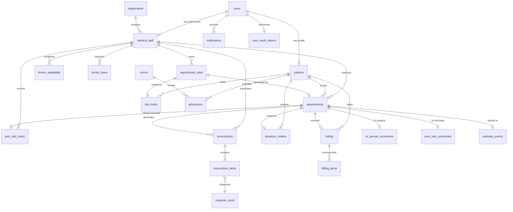

# 🗄️ Hospital Management System (HMS) — Database Architecture Reference

Comprehensive database schema documentation for the Hospital Management System PostgreSQL database managed via Supabase.

---

## 📑 Table of Contents

1. [Entity Relationship Overview](#-entity-relationship-overview)
2. [PostgreSQL Enums & Custom Types](#-postgresql-enums--custom-types)
3. [Core Personnel & Identity Tables](#1-core-personnel--identity-tables)
4. [Appointment & Scheduling Tables](#2-appointment--scheduling-tables)
5. [AI Clinical Intelligence Tables](#3-ai-clinical-intelligence-tables)
6. [Clinical Documentation, Prescriptions & Pharmacy](#4-clinical-documentation-prescriptions--pharmacy)
7. [Inpatient Admissions & Room Management](#5-inpatient-admissions--room-management)
8. [Billing & Financial Tables](#6-billing--financial-tables)
9. [Notifications, Calendar & Audit Logging](#7-notifications-calendar--audit-logging)
10. [Stored Procedures & Atomic Concurrency RPCs](#8-stored-procedures--atomic-concurrency-rpcs)
11. [Row Level Security (RLS) & Triggers](#9-row-level-security-rls--triggers)

---

## 📊 Entity Relationship Overview



---

## 🔠 PostgreSQL Enums & Custom Types

| Type Name | Possible Values | Purpose |
| :--- | :--- | :--- |
| `appointment_status` | `HELD`, `CONFIRMED`, `COMPLETED`, `CANCELLED`, `RESCHEDULE_REQUIRED`, `DOCTOR_LEAVE_CONFLICT` | Lifecycle state machine for appointments |
| `slot_status` | `AVAILABLE`, `HELD`, `BOOKED`, `BLOCKED`, `CANCELLED` | Availability state of discrete doctor slots |
| `hold_status` | `ACTIVE`, `EXPIRED`, `CONSUMED`, `RELEASED` | Status of temporary 5-minute slot reservations |
| `leave_type` | `ANNUAL`, `SICK`, `UNPAID`, `MATERNITY`, `OTHER` | Doctor leave classification |
| `leave_status` | `PENDING`, `APPROVED`, `REJECTED`, `CANCELLED` | Approval status of doctor leave requests |
| `cancel_reason_type`| `PATIENT_REQUEST`, `DOCTOR_UNAVAILABLE`, `ADMIN_CANCELLED`, `NO_SHOW`, `OTHER` | Structured categorization for cancellations |

---

## 1. Core Personnel & Identity Tables

### `public.users`
- **Purpose:** Primary public user profile linked 1:1 with Supabase Auth (`auth.users`).
- **Primary Key:** `user_id` (UUID) $\rightarrow$ `auth.users(id)` ON DELETE CASCADE
- **Columns:**
  - `user_id` (UUID, PK)
  - `national_id` (TEXT, UNIQUE, Nullable)
  - `first_name` (TEXT, NOT NULL)
  - `last_name` (TEXT, NOT NULL)
  - `date_of_birth` (DATE)
  - `gender` (TEXT)
  - `address` (TEXT)
  - `phone_number` (TEXT)
  - `created_at` (TIMESTAMPTZ, default: `NOW()`)
  - `updated_at` (TIMESTAMPTZ, default: `NOW()`)

### `public.patients`
- **Purpose:** Clinical patient profiles containing healthcare-specific metadata.
- **Primary Key:** `patient_id` (BIGINT GENERATED ALWAYS AS IDENTITY)
- **Foreign Keys:**
  - `user_id` (UUID, UNIQUE) $\rightarrow$ `users(user_id)` ON DELETE CASCADE
  - `emergency_contact_id` (BIGINT, Nullable) $\rightarrow$ `patients(patient_id)`
- **Columns:**
  - `patient_id` (BIGINT, PK)
  - `user_id` (UUID, UNIQUE, NOT NULL)
  - `blood_type` (TEXT, CHECK: `blood_type IN ('A+', 'A-', 'B+', 'B-', 'AB+', 'AB-', 'O+', 'O-')`)
  - `emergency_contact_id` (BIGINT)
  - `created_at` / `updated_at` (TIMESTAMPTZ)

### `public.medical_staff`
- **Purpose:** Hospital personnel directory with assigned professional roles and departments.
- **Primary Key:** `staff_id` (BIGINT GENERATED ALWAYS AS IDENTITY)
- **Foreign Keys:**
  - `user_id` (UUID, UNIQUE) $\rightarrow$ `users(user_id)` ON DELETE CASCADE
  - `department_id` (BIGINT, Nullable) $\rightarrow$ `departments(department_id)`
- **Columns:**
  - `staff_id` (BIGINT, PK)
  - `user_id` (UUID, UNIQUE, NOT NULL)
  - `department_id` (BIGINT)
  - `staff_type` (TEXT, NOT NULL, CHECK: `staff_type IN ('Doctor', 'Nurse', 'Pharmacist', 'Admin')`)
  - `license_number` (TEXT, UNIQUE, Nullable)
  - `employment_status` (TEXT, CHECK: `employment_status IN ('Active', 'On Leave', 'Terminated')`)
  - `date_hired` (DATE)

### `public.departments`
- **Purpose:** Medical departments and hospital service divisions.
- **Primary Key:** `department_id` (BIGINT GENERATED ALWAYS AS IDENTITY)
- **Columns:** `department_id` (PK), `name` (TEXT, UNIQUE, NOT NULL), `description` (TEXT).

### `public.specialties` & `public.doctor_specialties`
- **Purpose:** Clinical specialty taxonomy and many-to-many doctor specialization associations.
- **Foreign Keys:** `doctor_id` $\rightarrow$ `medical_staff(staff_id)`, `specialty_id` $\rightarrow$ `specialties(specialty_id)`.

---

## 2. Appointment & Scheduling Tables

### `public.doctor_availability`
- **Purpose:** Recurring weekly template defining doctor shifts and break times.
- **Primary Key:** `availability_id` (BIGINT GENERATED ALWAYS AS IDENTITY)
- **Foreign Keys:** `doctor_id` $\rightarrow$ `medical_staff(staff_id)` ON DELETE CASCADE
- **Columns:**
  - `availability_id` (BIGINT, PK)
  - `doctor_id` (BIGINT, NOT NULL)
  - `day_of_week` (SMALLINT, CHECK: `0 <= day_of_week <= 6`, 0=Sunday)
  - `start_time` (TIME, NOT NULL)
  - `end_time` (TIME, NOT NULL, CHECK: `end_time > start_time`)
  - `break_start_time` (TIME, Nullable)
  - `break_end_time` (TIME, Nullable, CHECK: `break_end_time > break_start_time`)
  - `slot_duration_minutes` (INTEGER, default: 30, CHECK: `slot_duration_minutes > 0`)
  - `is_available` (BOOLEAN, default: TRUE)
- **Unique Constraint:** `UNIQUE (doctor_id, day_of_week)`

### `public.doctor_leave`
- **Purpose:** Scheduled doctor time-off requests used to block slot generation and resolve conflicts.
- **Primary Key:** `leave_id` (BIGINT GENERATED ALWAYS AS IDENTITY)
- **Foreign Keys:** `doctor_id` $\rightarrow$ `medical_staff(staff_id)` ON DELETE CASCADE
- **Columns:**
  - `leave_id` (BIGINT, PK)
  - `doctor_id` (BIGINT, NOT NULL)
  - `start_date` (DATE, NOT NULL)
  - `end_date` (DATE, NOT NULL, CHECK: `end_date >= start_date`)
  - `leave_type` (`leave_type`, default: `'ANNUAL'`)
  - `status` (`leave_status`, default: `'PENDING'`)
  - `reason` (TEXT)
  - `created_at` (TIMESTAMPTZ)

### `public.appointment_slots`
- **Purpose:** Discrete time slots available for patient booking.
- **Primary Key:** `slot_id` (BIGINT GENERATED ALWAYS AS IDENTITY)
- **Foreign Keys:** `doctor_id` $\rightarrow$ `medical_staff(staff_id)` ON DELETE CASCADE
- **Columns:**
  - `slot_id` (BIGINT, PK)
  - `doctor_id` (BIGINT, NOT NULL)
  - `start_time` (TIMESTAMPTZ, NOT NULL)
  - `end_time` (TIMESTAMPTZ, NOT NULL, CHECK: `end_time > start_time`)
  - `duration_minutes` (INTEGER, NOT NULL)
  - `status` (`slot_status`, default: `'AVAILABLE'`)
- **Indexes & Constraints:**
  - `UNIQUE (doctor_id, start_time)`
  - Index: `idx_slots_doctor_time (doctor_id, start_time)`
  - Index: `idx_slots_status (status)`

### `public.slot_holds`
- **Purpose:** Temporary 5-minute atomic reservations protecting slots from concurrent booking.
- **Primary Key:** `hold_id` (BIGINT GENERATED ALWAYS AS IDENTITY)
- **Foreign Keys:**
  - `slot_id` $\rightarrow$ `appointment_slots(slot_id)` ON DELETE CASCADE
  - `patient_id` $\rightarrow$ `patients(patient_id)` ON DELETE CASCADE
- **Columns:**
  - `hold_id` (BIGINT, PK)
  - `slot_id` (BIGINT, NOT NULL)
  - `patient_id` (BIGINT, NOT NULL)
  - `hold_token` (UUID, UNIQUE, default: `gen_random_uuid()`)
  - `held_at` (TIMESTAMPTZ, default: `NOW()`)
  - `expires_at` (TIMESTAMPTZ, NOT NULL)
  - `released_at` (TIMESTAMPTZ, Nullable)
  - `status` (`hold_status`, default: `'ACTIVE'`)
- **Indexes:**
  - Index: `idx_slot_holds_token (hold_token)`
  - Index: `idx_slot_holds_active (slot_id, status) WHERE status = 'ACTIVE'`

### `public.appointments`
- **Purpose:** Authoritative clinical appointment records.
- **Primary Key:** `appointment_id` (BIGINT GENERATED ALWAYS AS IDENTITY)
- **Foreign Keys:**
  - `slot_id` $\rightarrow$ `appointment_slots(slot_id)` ON DELETE SET NULL
  - `patient_id` $\rightarrow$ `patients(patient_id)` ON DELETE CASCADE
  - `doctor_id` $\rightarrow$ `medical_staff(staff_id)` ON DELETE CASCADE
  - `booked_by_user_id` $\rightarrow$ `users(user_id)`
  - `rescheduled_from_id` $\rightarrow$ `appointments(appointment_id)`
- **Columns:**
  - `appointment_id` (BIGINT, PK)
  - `slot_id` (BIGINT, Nullable)
  - `patient_id` (BIGINT, NOT NULL)
  - `doctor_id` (BIGINT, NOT NULL)
  - `status` (`appointment_status`, default: `'CONFIRMED'`)
  - `reason_for_visit` (TEXT)
  - `booked_at` (TIMESTAMPTZ, default: `NOW()`)
  - `confirmed_at` (TIMESTAMPTZ)
  - `completed_at` (TIMESTAMPTZ)
  - `cancelled_at` (TIMESTAMPTZ)
  - `cancel_reason` (`cancel_reason_type`)
  - `cancel_reason_text` (TEXT)
  - `reschedule_count` (INTEGER, default: 0)
  - `timezone` (TEXT, default: `'UTC'`)
  - `idempotency_key` (TEXT, UNIQUE, Nullable)

---

## 3. AI Clinical Intelligence Tables

### `public.symptom_intakes`
- **Purpose:** Structured patient pre-visit symptom responses.
- **Foreign Keys:** `appointment_id` $\rightarrow$ `appointments(appointment_id)`, `patient_id` $\rightarrow$ `patients(patient_id)`
- **Columns:** `intake_id` (PK), `symptoms` (TEXT), `severity` (TEXT), `duration_days` (INT), `is_worsening` (BOOL), `additional_notes` (TEXT), `consent_given` (BOOL).

### `public.ai_previsit_summaries`
- **Purpose:** Google Gemini-generated pre-visit clinical briefing and suggested patient questions.
- **Foreign Keys:** `appointment_id` (UNIQUE) $\rightarrow$ `appointments(appointment_id)`, `intake_id` $\rightarrow$ `symptom_intakes(intake_id)`
- **Columns:**
  - `summary_id` (BIGINT, PK)
  - `appointment_id` (BIGINT, UNIQUE, NOT NULL)
  - `intake_id` (BIGINT, NOT NULL)
  - `status` (TEXT, CHECK: `status IN ('PENDING', 'PROCESSING', 'COMPLETED', 'FAILED')`)
  - `chief_complaint` (TEXT)
  - `urgency_rating` (TEXT, CHECK: `urgency_rating IN ('EMERGENT', 'URGENT', 'ROUTINE', 'SELF_CARE')`)
  - `clinical_summary` (TEXT)
  - `suggested_questions` (JSONB)
  - `raw_response` (JSONB)
  - `error_message` (TEXT)

### `public.post_visit_notes` & `public.post_visit_summaries`
- **Purpose:** Doctor clinical consultation records and AI-generated patient post-visit takeaways.
- **Foreign Keys:** `appointment_id` $\rightarrow$ `appointments(appointment_id)`.

---

## 4. Clinical Documentation, Prescriptions & Pharmacy

### `public.medical_records`
- **Purpose:** General patient health histories, diagnoses, and treatments.
- **Foreign Keys:** `patient_id` $\rightarrow$ `patients(patient_id)`, `doctor_id` $\rightarrow$ `medical_staff(staff_id)`.

### `public.medicine_stock`
- **Purpose:** Real-time hospital pharmacy catalog and inventory tracking.
- **Primary Key:** `medicine_id` (BIGINT GENERATED ALWAYS AS IDENTITY)
- **Columns:**
  - `medicine_id` (BIGINT, PK)
  - `name` (TEXT, NOT NULL)
  - `dosage` (TEXT, NOT NULL)
  - `quantity_in_stock` (INTEGER, NOT NULL, CHECK: `quantity_in_stock >= 0`)
  - `unit_price` (NUMERIC(10,2), NOT NULL, CHECK: `unit_price >= 0`)
  - `reorder_threshold` (INTEGER, default: 20)

### `public.prescriptions` & `public.prescription_items`
- **Purpose:** Doctor medication orders and line-item dosages.
- **Foreign Keys:** `prescription_id` $\rightarrow$ `prescriptions(prescription_id)`, `medicine_id` $\rightarrow$ `medicine_stock(medicine_id)`.

### `public.medicine_dispense`
- **Purpose:** Transaction ledger recording pharmacy deductions and dispensing pharmacist.
- **Foreign Keys:** `prescription_id` $\rightarrow$ `prescriptions`, `dispensed_by` $\rightarrow$ `medical_staff(staff_id)`.

### `public.medication_reminders`
- **Purpose:** Patient prescription schedule reminder queue.

---

## 5. Inpatient Admissions & Room Management

### `public.rooms`
- **Purpose:** Inpatient hospital rooms and daily occupancy pricing.
- **Primary Key:** `room_id` (BIGINT GENERATED ALWAYS AS IDENTITY)
- **Columns:** `room_id` (PK), `room_number` (TEXT, UNIQUE, NOT NULL), `room_type` (TEXT), `daily_rate` (NUMERIC(10,2)), `status` (TEXT).

### `public.admissions`
- **Purpose:** Inpatient care records linking admitted patients to rooms and assigned duty nurses.
- **Foreign Keys:**
  - `patient_id` $\rightarrow$ `patients(patient_id)`
  - `room_id` $\rightarrow$ `rooms(room_id)`
  - `nurse_id` $\rightarrow$ `medical_staff(staff_id)`

---

## 6. Billing & Financial Tables

### `public.billing`
- **Purpose:** Master hospital billing invoices.
- **Primary Key:** `invoice_id` (BIGINT GENERATED ALWAYS AS IDENTITY)
- **Foreign Keys:** `patient_id` $\rightarrow$ `patients(patient_id)`, `appointment_id` $\rightarrow$ `appointments(appointment_id)`
- **Columns:** `invoice_id` (PK), `total_amount` (NUMERIC(10,2)), `paid_amount` (NUMERIC(10,2)), `status` (TEXT: `'PAID'`, `'PENDING'`, `'CANCELLED'`), `due_date` (DATE), `paid_at` (TIMESTAMPTZ).

### `public.billing_items`
- **Purpose:** Itemized invoice line charges.
- **Foreign Keys:** `invoice_id` $\rightarrow$ `billing(invoice_id)` ON DELETE CASCADE
- **Columns:** `item_id` (PK), `invoice_id` (BIGINT), `item_type` (TEXT: `'Medicine'`, `'Room'`, `'Consultation'`, `'Lab'`), `description` (TEXT), `quantity` (INT), `unit_price` (NUMERIC(10,2)), `total_price` (NUMERIC(10,2)).

---

## 7. Notifications, Calendar & Audit Logging

### `public.notifications`
- **Purpose:** Asynchronous multi-channel notification outbox and retry queue.
- **Columns:**
  - `notification_id` (BIGINT, PK)
  - `user_id` (UUID, Nullable)
  - `patient_id` / `staff_id` / `appointment_id` (BIGINT, Nullable)
  - `type` (TEXT, e.g. `'BOOKING_CONFIRMATION'`, `'APPOINTMENT_CANCELLATION'`)
  - `channel` (TEXT: `'EMAIL'`, `'SMS'`, `'IN_APP'`)
  - `recipient` (TEXT, NOT NULL)
  - `subject` / `body` (TEXT)
  - `status` (TEXT: `'PENDING'`, `'SENDING'`, `'SENT'`, `'FAILED'`, `'DELIVERED'`)
  - `provider` (TEXT: `'resend'`, `'sendgrid'`, `'stub'`)
  - `provider_message_id` (TEXT)
  - `retry_count` (INT, default: 0)
  - `max_retries` (INT, default: 3)
  - `dedupe_key` (TEXT, UNIQUE, Nullable)
  - `last_error` (TEXT)
  - `sent_at` (TIMESTAMPTZ)

### `public.user_oauth_tokens`
- **Purpose:** Encrypted OAuth 2.0 access & refresh tokens for Google Calendar integration.
- **Columns:** `token_id` (PK), `user_id` (UUID, UNIQUE), `provider` (TEXT), `encrypted_access_token` (TEXT), `encrypted_refresh_token` (TEXT), `expires_at` (TIMESTAMPTZ).

### `public.calendar_events`
- **Purpose:** Mapping of appointments to Google Calendar event IDs.
- **Columns:** `event_id` (PK), `appointment_id` (BIGINT, UNIQUE), `google_event_id` (TEXT), `synced_at` (TIMESTAMPTZ).

### `public.audit_logs`
- **Purpose:** Tamper-evident operational audit trail.

---

## 8. Stored Procedures & Atomic Concurrency RPCs

### 1. `atomic_hold_slot()`
```sql
atomic_hold_slot(
  p_doctor_id BIGINT,
  p_slot_id BIGINT,
  p_patient_id BIGINT,
  p_hold_duration_s INTEGER DEFAULT 300,
  p_allow_expire BOOLEAN DEFAULT TRUE
)
RETURNS TABLE (hold_id BIGINT, hold_token UUID, expires_at TIMESTAMPTZ, slot_id BIGINT, start_time TIMESTAMPTZ, end_time TIMESTAMPTZ)
```
- **Execution Mechanism:**
  1. Computes 64-bit advisory lock key from `p_slot_id` via `pg_advisory_xact_lock`.
  2. Cleans up expired holds on the slot.
  3. Row-locks slot with `SELECT ... FOR UPDATE`.
  4. Validates invariants: slot belongs to doctor, slot is in the future, slot is `AVAILABLE`, doctor is not on approved leave.
  5. Transitions slot status `AVAILABLE` $\rightarrow$ `HELD`.
  6. Inserts `slot_holds` record and returns generated `hold_token`.

### 2. `atomic_confirm_booking()`
```sql
atomic_confirm_booking(
  p_hold_token UUID,
  p_patient_id BIGINT,
  p_reason TEXT DEFAULT NULL,
  p_timezone TEXT DEFAULT 'UTC',
  p_idempotency TEXT DEFAULT NULL,
  p_booked_by UUID DEFAULT NULL
)
RETURNS TABLE (appointment_id BIGINT, slot_id BIGINT, doctor_id BIGINT, patient_id BIGINT, status appointment_status, idempotent BOOLEAN)
```
- **Execution Mechanism:**
  1. Validates `p_idempotency` — returns existing appointment if duplicate request detected.
  2. Locks and validates `slot_holds` record by `p_hold_token`: must be `ACTIVE`, `expires_at > NOW()`, and `patient_id` matches.
  3. Transitions slot status `HELD` $\rightarrow$ `BOOKED`.
  4. Transitions hold status `ACTIVE` $\rightarrow$ `CONSUMED`.
  5. Inserts appointment record with status `CONFIRMED`.

### 3. `cancel_appointment()`
```sql
cancel_appointment(
  p_appointment_id BIGINT,
  p_patient_id BIGINT,
  p_caller_user_id UUID,
  p_caller_role TEXT,
  p_reason cancel_reason_type,
  p_reason_text TEXT DEFAULT NULL
)
```
- **Execution Mechanism:**
  1. Row-locks appointment record.
  2. Verifies ownership based on role (`Patient` can only cancel own; `Doctor` can cancel own appointments; `Admin` has global bypass).
  3. Transitions appointment status $\rightarrow$ `CANCELLED`.
  4. Releases associated slot back to `AVAILABLE`.

### 4. `process_doctor_leave_conflicts()`
```sql
process_doctor_leave_conflicts(
  p_doctor_id BIGINT,
  p_start_date DATE,
  p_end_date DATE
)
```
- **Execution Mechanism:**
  1. Transitions all `AVAILABLE` slots within the leave window $\rightarrow$ `BLOCKED`.
  2. Releases active holds on those slots.
  3. Transitions already `CONFIRMED` appointments during the leave window $\rightarrow$ `DOCTOR_LEAVE_CONFLICT`.

---

## 9. Row Level Security (RLS) & Triggers

### 1. State Transition Check Trigger
```sql
CREATE TRIGGER appointments_check_transition_trg
  BEFORE UPDATE OF status ON public.appointments
  FOR EACH ROW EXECUTE FUNCTION public.appointments_check_transition();
```
- Enforces valid state machine paths (`HELD` $\rightarrow$ `CONFIRMED`/`CANCELLED`; `CONFIRMED` $\rightarrow$ `COMPLETED`/`CANCELLED`/`RESCHEDULE_REQUIRED`/`DOCTOR_LEAVE_CONFLICT`).

### 2. Audit Trail Protection
- `prevent_audit_log_modification()` trigger blocks `UPDATE` and `DELETE` operations on `audit_logs`.

### 3. Privilege Escalation Guard
- `prevent_medical_staff_self_escalation()` trigger prevents non-admin staff from modifying their own `staff_type`.
