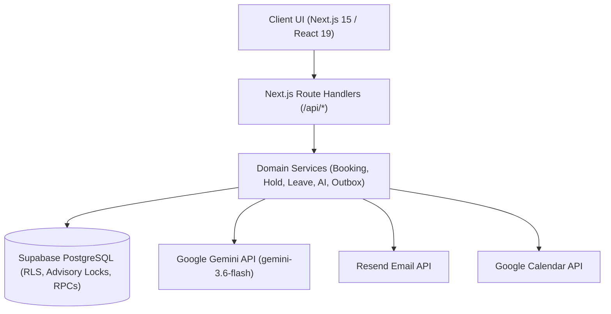

# 🏥 Hospital Management System (HMS) — System Design Document

---

## 1. Problem Statement & Scope

Healthcare facilities often suffer from fragmented systems where appointment booking, doctor schedules, patient intake, pharmacy, and billing operate in silos. This causes race-condition double bookings, high no-shows, administrative overhead, and clinical documentation gaps.

**HMS** unifies clinical consultations, concurrency-safe scheduling, AI-assisted documentation, multi-provider notifications, pharmacy inventory, and billing into a single role-aware platform.

---

## 2. High-Level Architecture

HMS connects a Next.js 15 App Router frontend to domain services and a Supabase PostgreSQL database.

---

## 3. Layered Request Lifecycle

1. **Presentation:** Role dashboards (`/admin`, `/doctor`, `/nurse`, `/patient`, `/pharmacy`) built with React 19 and Radix UI.
2. **API & Validation:** Route handlers verify JWT sessions, resolve identity (`resolveIdentity`), enforce role guards (`requireRoles`), and validate payloads with Zod.
3. **Domain Services:** Pure TypeScript business logic orchestrates state transitions, schedules, and asynchronous background dispatch.
4. **Database:** Supabase PostgreSQL manages relational integrity, Row Level Security (RLS), and ACID transactions.

---

## 4. Authentication & Role-Based Access Control (RBAC)

- **Identity Layer:** Supabase Auth manages sessions via HTTP-only JWT cookies.
- **Role Scopes:** 5 roles (`Admin`, `Doctor`, `Nurse`, `Patient`, `Pharmacist`) mapped across `users`, `patients`, and `medical_staff`.
- **Service Client Isolation:** To prevent recursive RLS evaluation on joined tables, administrative server routines use `createServiceClient()` strictly *after* API boundary role authorization checks.

---

## 5. Appointment Concurrency & Lifecycle

To prevent concurrent double-booking, HMS uses a two-phase reservation pipeline:

1. **Slot Generation:** Automated generator converts doctor recurring availability templates into discrete slots.
2. **Atomic 5-Minute Hold (`atomic_hold_slot`):**
   - Acquires a 64-bit PostgreSQL advisory lock on `slot_id`.
   - Expires stale holds (`expires_at < NOW()`).
   - Locks slot row (`FOR UPDATE`), validates doctor leave and future timestamp invariants.
   - Transitions slot `AVAILABLE` $\rightarrow$ `HELD` and returns a 5-minute UUID `hold_token`.
3. **Atomic Booking Confirmation (`atomic_confirm_booking`):**
   - Validates active `hold_token` and deduplicates using `idempotency_key`.
   - Transitions slot `HELD` $\rightarrow$ `BOOKED`, hold `ACTIVE` $\rightarrow$ `CONSUMED`, and creates appointment `CONFIRMED`.
4. **Cancellation (`cancel_appointment`):**
   - Verifies caller ownership/role, transitions appointment $\rightarrow$ `CANCELLED`, and frees slot $\rightarrow$ `AVAILABLE`.

---

## 6. Doctor Leave & Conflict Handling

When doctor leave is approved:
- `process_doctor_leave_conflicts` RPC blocks `AVAILABLE` slots in the leave window (`status = 'BLOCKED'`) and releases active holds.
- Existing `CONFIRMED` appointments update to `DOCTOR_LEAVE_CONFLICT` or `RESCHEDULE_REQUIRED`.
- Outbox engine dispatches rescheduling notifications to affected patients.

---

## 7. AI Clinical Intelligence Pipeline

Powered by Google Gemini (`gemini-3.6-flash`) with structured JSON parsing:

- **Pre-Visit Scribe (`PREVISIT_V1`):** Summarizes patient symptoms into chief complaint, urgency rating (`LOW` | `MEDIUM` | `HIGH`), and 3 clarifying questions for the doctor.
- **Post-Visit Scribe (`POSTVISIT_V1`):** Translates doctor notes, diagnosis, and prescriptions into plain-language patient summaries, medication schedules, and red-flag warnings.
- **Resilience & Fallback:** Patient opt-out consent is respected. API errors or JSON parse failures record non-blocking `FAILED` records in `ai_previsit_summaries` without disrupting clinical booking.

---

## 8. Asynchronous Notifications & Outbox

- **Decoupled Outbox:** Outbox events (`outboxBookingConfirmed`, `outboxAppointmentCancelled`) trigger background dispatch without delaying HTTP responses.
- **Providers:** Resend API HTTP client (production) with fallback to in-memory stub (testing).
- **Deduplication & Retries:** Unique `dedupe_key` prevents duplicate emails. Background worker (`POST /api/notifications/retry`) retries failed sends with exponential backoff up to 3 times.

---

## 9. Google Calendar Synchronization

- **OAuth 2.0 Flow:** Doctors authorize via `/api/calendar/authorize` with `offline` access.
- **Cryptographic Vault:** Tokens are encrypted at rest using authenticated **AES-256-GCM** (`lib/crypto/vault.ts`).
- **Event Lifecycle:** Automatically creates (`fireCalendarCreate`), updates (`fireCalendarUpdate`), and deletes (`fireCalendarDelete`) calendar events.

---

## 10. Database Design & Atomic RPCs

PostgreSQL 15+ database organized across 30 tables with 6 domain enums. Core business logic is encapsulated in PL/pgSQL stored procedures:
- `atomic_hold_slot`, `atomic_confirm_booking`, `cancel_appointment`, `process_doctor_leave_conflicts`, `expire_stale_holds`.
- Trigger `appointments_check_transition_trg` strictly validates appointment state transitions.

---

## 11. Security & Reliability

- **Data Protection:** AES-256-GCM encryption for OAuth tokens; zero plaintext storage of external secrets.
- **Input Validation:** Strict Zod schema parsing on all mutation payloads.
- **Idempotency:** Unique keys prevent duplicate bookings and duplicate notification dispatch.
- **Fault Tolerance:** Non-blocking background workers isolate external service failures from core clinical operations.

---

## 12. Key Design Trade-offs

| Decision | Advantage | Trade-off |
| :--- | :--- | :--- |
| **PostgreSQL Advisory Locks** | Zero-latency atomic slot locking without external Redis | Ties lock concurrency to database transaction scope |
| **Async Outbox Dispatch** | Fast API response times; decoupled external dependencies | Eventual consistency for email/calendar reflection |
| **Server Service Boundary** | Eliminates recursive RLS evaluation on complex joins | Requires strict application-level role validation |
